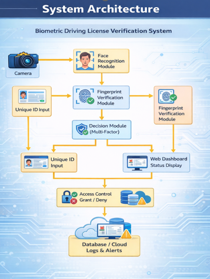
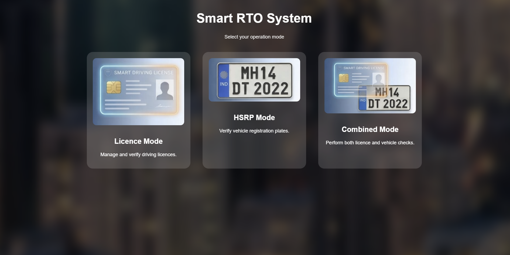
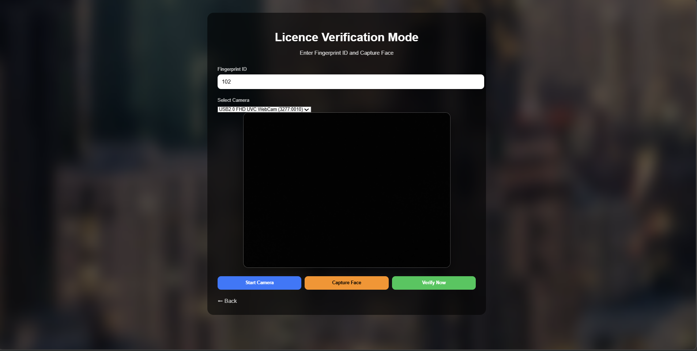
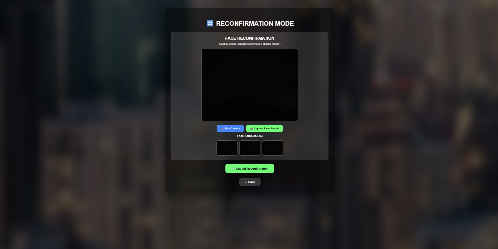
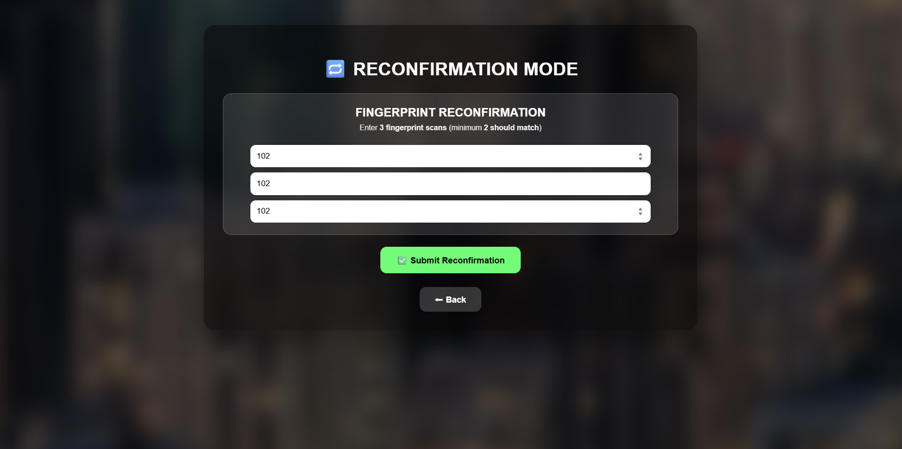
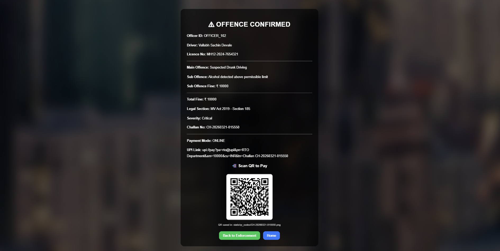

<h1 align="center"> AI Driving Licence Verification System</h1>

<p align="center">
  <b>Biometric-Based Smart Verification System for RTO Integration</b>
</p>

<p align="center">
  
  
  
  
</p>

---

##  Overview

The AI Driving Licence Verification System is a smart and scalable solution designed to authenticate drivers using biometric verification (Face Recognition & Fingerprint) integrated with a Flask-based web system and Firebase database.

This system is developed with a real-world deployment approach, enabling seamless integration with existing RTO infrastructure without requiring major system changes.

---

## Problem Statement

Traditional driving licence verification systems rely on manual checks or ID-based validation, which are prone to fraud, duplication, and human error.

---

## Proposed Solution

This system introduces AI-based biometric verification using Face Recognition and Fingerprint Authentication to ensure secure, real-time identity validation.  

It is designed to integrate seamlessly with existing RTO infrastructure, making it scalable and cost-efficient.

---

##  Advanced System Capabilities

### Multi-Modal Authentication

* Supports Face Recognition and Fingerprint Authentication
* System validates identity using any one or both biometric methods
* Designed for integration with existing biometric hardware systems

---

### RTO Integration Ready

* Built for real-world deployment
* Compatible with existing:

  * RTO systems
  * Biometric devices
    
* Focus on cost-efficient implementation
* No need to redesign infrastructure

---

###  Multi-Mode Operation System

#### Licence Verification Mode

* Verifies driver using biometric authentication
* Supports Face + Fingerprint
* Includes Reconfirmation Mode:

  * Re-validates identity on mismatch
  * Improves accuracy

---

#### HSRP Verification Mode

* Validates vehicle using High Security Registration Plate
* Works independently for vehicle-level checks

---

#### Combined Mode (Smart Enforcement)

* Combines:

  * Driver verification
  * Vehicle verification
* Useful for:

  * Traffic police
  * Checkpoints
  * Smart enforcement systems

---

### Intelligent Reconfirmation System

* Triggered when mismatch occurs
* Re-checks biometric identity
* Reduces:
  * False rejection
  * Errors
* Ensures high reliability

---

###  Scalability & Impact

* Designed for large-scale deployment
* Extendable to:

  * Smart city systems
  * Law enforcement tools
  * National identity systems
    
* Helps:

  * Reduce fraud
  * Improve safety
  * Automate verification

---

## Key Features

✔ Face Recognition Authentication
✔ Fingerprint Authentication Support
✔ Licence Verification System
✔ HSRP Vehicle Verification
✔ Combined Smart Mode
✔ Automated Challan Generation
✔ Firebase Integration
✔ Web-based Dashboard

---

## System Workflow

1. User selects mode (Licence / HSRP / Combined)
2. System captures biometric input (Face/Fingerprint)
3. Input processed using AI model
4. Decision engine validates identity
5. Firebase database is checked
6. Output generated:
   - Verification success/failure
   - Challan generation (if violation detected)

---

## System Architecture



---

## Payment System

- UPI QR Code-based challan payment  
- Real-time payment status updates  
- Integrated fine management system

---

## Reports & Analytics

- Enforcement reports generation  
- Officer-wise fine collection tracking  
- Historical data logging

---

## Environment Setup

Create a `.env` file and add:

FIREBASE_KEY=your_key.json  
SECRET_KEY=your_secret_key

---

## System Screenshots

<p align="center">
  
</p>

<p align="center">
  
</p>

<p align="center">
  
</p>

<p align="center">
  
</p>

<p align="center">
  
</p>

<p align="center">
  
</p>

<p align="center">
  
</p>

---

## 🛠 Tech Stack

<p align="center">

| Technology  | Purpose           |
| ----------- | ----------------- |
| Python      | Core Programming  |
| Flask       | Backend Framework |
| OpenCV      | Face Recognition  |
| Firebase    | Database          |
| HTML/CSS/JS | Frontend          |

</p>

---

## Project Structure

```bash
MEGA_PROJECT_FIREBASE/
│── app.py
│── config.py
│── requirements.txt
│── README.md
│
├── enforcement/
├── enroll/
├── license/
├── hsrp/
├── payments/
├── reports/
├── utils/
│
├── templates/
├── static/
├── images/
├── uploads/
```

---

## How to Run

```bash
git clone https://github.com/VallabhDevale-tech/ai-driving-licence-verification.git
cd ai-driving-licence-verification

python -m venv venv
venv\Scripts\activate

pip install -r requirements.txt
python app.py
```

---

## Security

* Firebase keys are not exposed
* Environment variables used for sensitive data

---

## Future Scope

* Mobile App Integration
* Cloud Deployment
* Aadhaar Integration
* Smart Police Dashboard
* Analytics & Reports

---

## Author

<p align="center">
<b>Vallabh Devale</b><br>
AIML Student | AI Developer | Problem Solver
</p>

---

## Support

<p align="center">
If you like this project STAR the repo and share it ...
</p>

---
